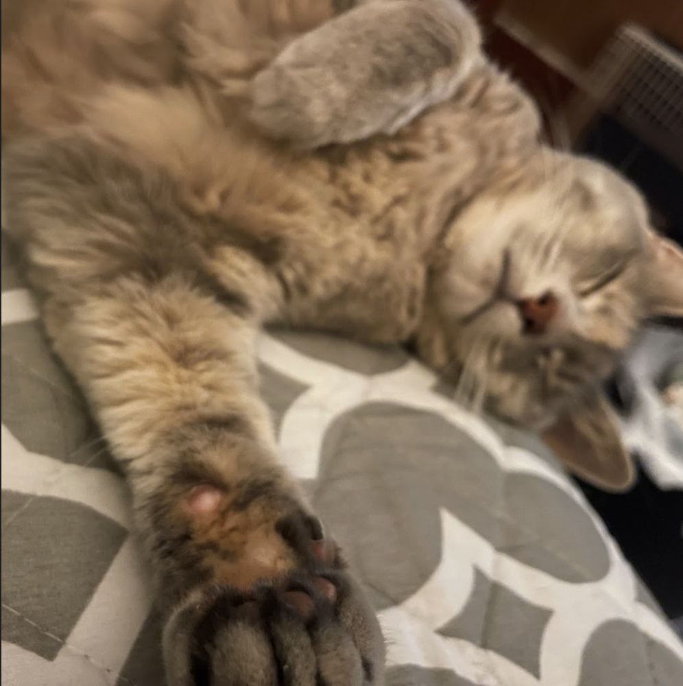
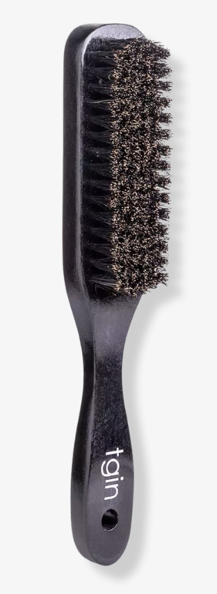
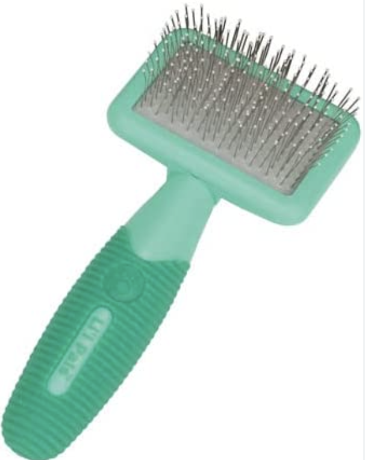
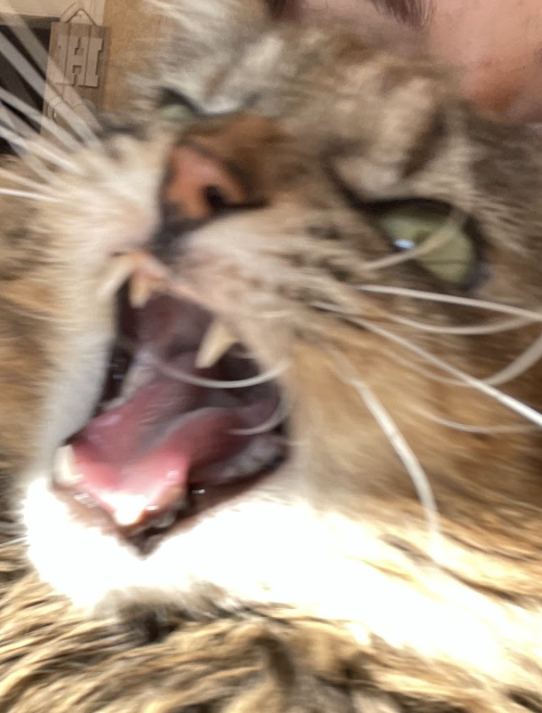

# How to Pet a Cat

#### a fool proof tutorial by Caitlin Randall

### What You Need: 
1 fully vaccinated and ideally friendly cat 

optional: glove for petting, cat treats 

### Instructions
1. Find a cat. If the cat found is unknown, proceed with caution, as you may be seriously injured or may frighten the cat, therefore being unable to pet said cat. 
2. Check to see if cat is friendly. If the cat appears to be feral or is exhibiting strange behavior, it is advised against touching said cat. 
3. Do not sneak up on cat from behind. Make sure that you are visible to the cat and be sure not to make sudden movements or loud noises that may startle or intimidate the cat.  
4. When within 2 feet of cat, crouch down so that you are lower to the ground and appear smaller and less intimidating. Reach hand out to cat and allow the cat to approach your hand. 
5. The cat will likely brush up against your hand with the top of their head, at which point it is okay to pet them. Gently stroke the cat's back, beginning at their head and extending to their tail. 
  - Alternatively, you may scratch behind the cat's ear, beneath their chin or at the base of their back (above their tail). Scratch gently with small motions. 
  - Although they may expose their belly or lie down when in a relaxed state, cats generally do not like their stomach or limbs to be touched, as well as their tail. All cats are different, so learn where your cat likes to be pet and be sure to respect their boundaries. 
  
  - If this is your pet cat, you may use a brush designated for cats to brush your cat. Cat hair will get in the brush, so be sure to use a different brush for humans. Specialized brushes for cats are manufactured, although a Boar Bristle Hair Brush will also work. 

Boar Bristle Brush                 | Brush Designed for Cats
:---------------------------------:|:---------------------------------:
  | 

  6. After a period of time (generally ranging from 5-10 minutes), the cat may become overstimulated and will no longer want to be touched. If this is the case, discontinue petting the cat and allow them to leave at free will. Cats do not respond well to being chased or being forcibly held or pet, so **do not disrespect the boundaries of the cat or you may receive bodily harm**. Listen to the body language of the cat and you will be okay. 
  - *Hint*: Purring typically indicates that the cat is enjoying being pet, as does them lifting their chin when being pet beneath their chin, closing their eyes when being pet on their head, or extending their hind legs when scratching near the base of their back above their tail. However, all cats have a threshold for touch, so make sure to give them intermittent breaks, otherwise you may be playfully bitten or pawed at. Only if you disrespect their boundaries and continue to pet them after these warning signs will they hiss, growl, bite and scratch, all of which are signs that they are uncomfortable. 

**if your cat looks like this, discontinue petting or holding them:**

### Happy Cat Petting!

  